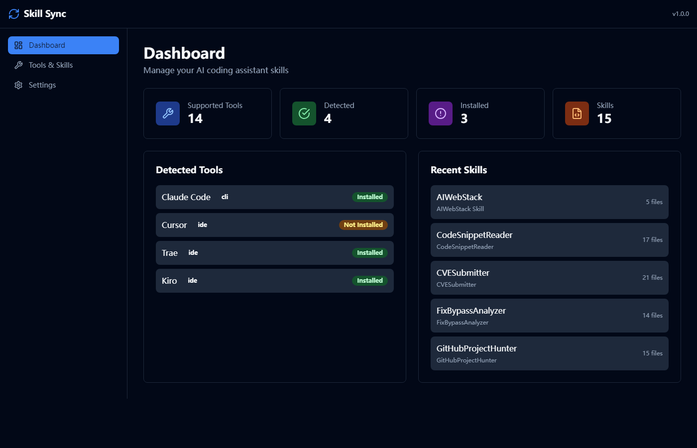
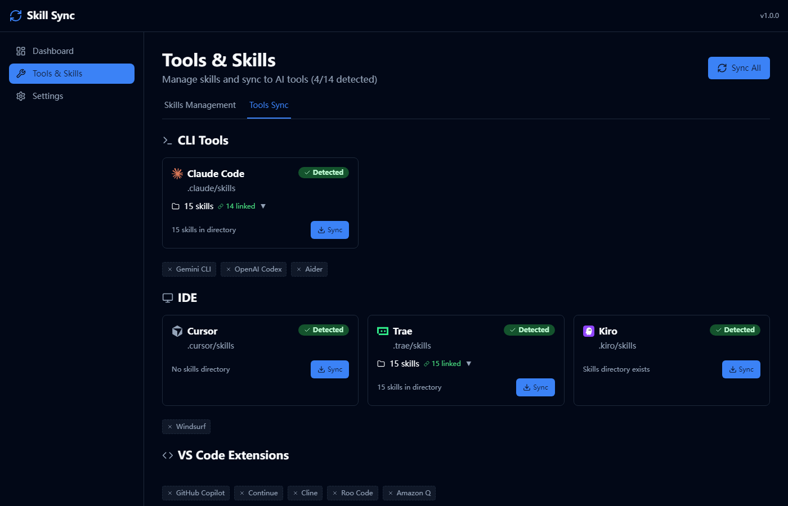
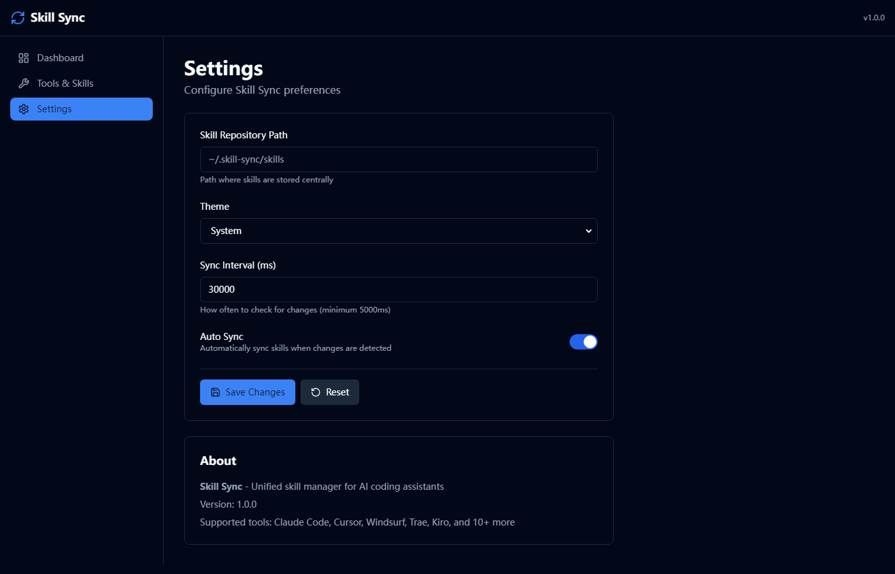

# Skill Sync

[](https://opensource.org/licenses/MIT)
[](https://www.typescriptlang.org/)
[](https://reactjs.org/)
[](https://fastify.io/)

**[English](./README.md)**

一个现代化的 Web 应用，用于管理和同步 AI 编程助手的 Skills。在中央仓库统一管理你的技能，并一键同步到 Claude Code、Cursor、Windsurf、Trae 等多个工具。

## ✨ 功能特性

- 🗂️ **中央仓库管理** - 在一个地方管理所有 AI 编程技能
- 🔄 **多工具同步** - 一键将 Skills 同步到多个 AI 编程助手
- 🔗 **符号链接支持** - 使用 symlink 方式同步，高效节省磁盘空间
- 👁️ **Skill 预览** - 支持 Markdown 渲染预览，自动解析 YAML 元信息
- 🔍 **自动检测** - 自动检测已安装的 AI 编程工具
- 📦 **批量操作** - 支持批量导入、同步、删除
- 🎨 **现代化界面** - 简洁响应式设计，支持暗色模式

## 📸 界面截图

| 仪表盘 | Skills 仓库 |
|:------:|:-----------:|
|  |  |

| 工具同步 | 设置 |
|:--------:|:----:|
|  |  |

## 🛠️ 支持的工具

| 工具 | 类型 | 状态 |
|------|------|:----:|
| [Claude Code](https://claude.ai/code) | CLI | ✅ |
| [Cursor](https://cursor.sh) | IDE | ✅ |
| [Windsurf](https://codeium.com/windsurf) | IDE | ✅ |
| [Trae](https://trae.ai) | IDE | ✅ |
| [Kiro](https://kiro.dev) | IDE | ✅ |
| [Gemini CLI](https://github.com/google-gemini/gemini-cli) | CLI | ✅ |
| [GitHub Copilot](https://github.com/features/copilot) | IDE/CLI | ✅ |
| [OpenAI Codex](https://github.com/openai/codex) | CLI | ✅ |
| [Cline](https://github.com/cline/cline) | VS Code 插件 | ✅ |

## 🚀 快速开始

### 环境要求

- Node.js 18+
- npm 或 pnpm

### 安装

```bash
# 克隆仓库
git clone https://github.com/your-username/skill-sync.git
cd skill-sync

# 安装依赖
npm install
```

### 开发模式

```bash
# 启动后端服务 (端口 3001)
npx tsx server/src/index.ts

# 在另一个终端启动前端 (端口 3000)
cd web && npm run dev
```

访问 `http://localhost:3000` 即可使用应用。

### 生产构建

```bash
npm run build
```

## 📁 项目结构

```
skill-sync/
├── server/                 # 后端服务 (Fastify)
│   └── src/
│       ├── routes/         # API 路由
│       ├── services/       # 业务逻辑
│       └── types/          # TypeScript 类型定义
├── web/                    # 前端应用 (React + Vite)
│   └── src/
│       ├── components/     # 可复用组件
│       ├── pages/          # 页面组件
│       ├── lib/            # 工具函数
│       └── store/          # 状态管理
└── icons/                  # 工具图标
```

## 📡 API 接口

### Skills

| 方法 | 端点 | 描述 |
|------|------|------|
| GET | `/api/skills` | 获取所有 Skills 列表 |
| GET | `/api/skills/:id` | 获取单个 Skill 详情 |
| GET | `/api/skills/:id/preview` | 预览 Skill 文件内容 |
| POST | `/api/skills/import` | 导入 Skills 到仓库 |
| POST | `/api/skills/delete` | 删除 Skills |

### Tools

| 方法 | 端点 | 描述 |
|------|------|------|
| GET | `/api/tools` | 获取所有支持的工具 |
| GET | `/api/tools/:id/skills` | 获取工具的 Skills |
| POST | `/api/tools/:id/sync` | 同步 Skills 到工具 |
| POST | `/api/tools/:id/delete-skills` | 删除工具中的 Skills |

### 配置

| 方法 | 端点 | 描述 |
|------|------|------|
| GET | `/api/config` | 获取当前配置 |
| PUT | `/api/config` | 更新配置 |

## 📝 Skill 规范

每个 Skill 包应包含 `SKILL.md` 文件，使用 YAML frontmatter 格式：

```markdown
---
name: 技能名称
description: 简要描述这个技能的功能
---

# 技能名称

详细的技能内容...
```

## 🎨 技术栈

- **前端**: React 18, TypeScript, Vite, Tailwind CSS, TanStack Query
- **后端**: Fastify, TypeScript
- **渲染**: react-markdown, remark-gfm, @tailwindcss/typography

## 🙏 致谢

- 工具图标来自 [lobe-icons](https://github.com/lobehub/lobe-icons)
- Kiro 图标来自 [Awesome-IDEs](https://github.com/zeelsheladiya/Awesome-IDEs)

## 📄 许可证

本项目基于 MIT 许可证开源 - 详见 [LICENSE](LICENSE) 文件。
