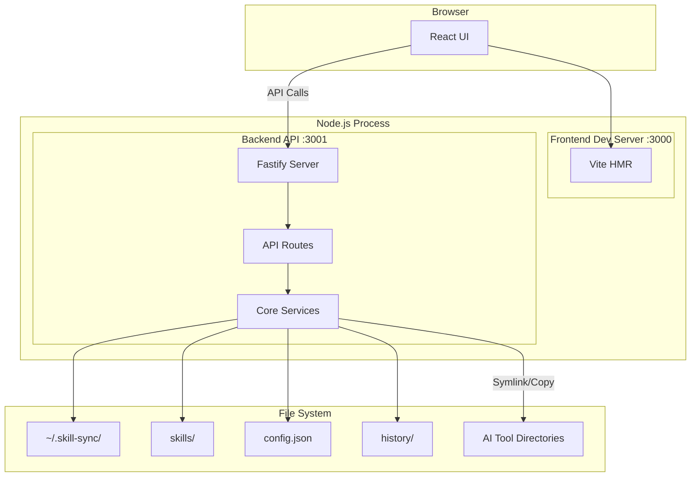
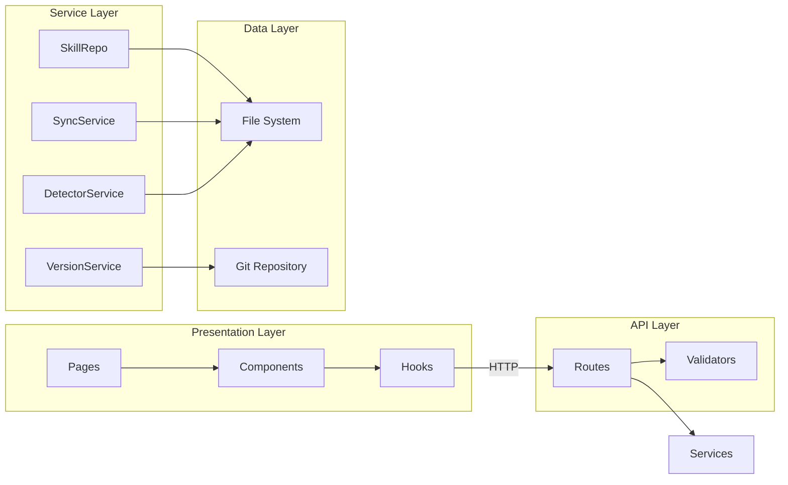
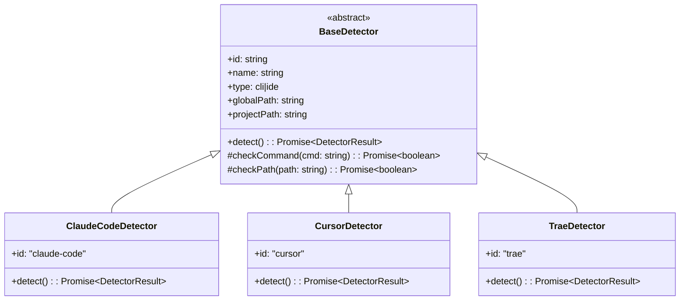
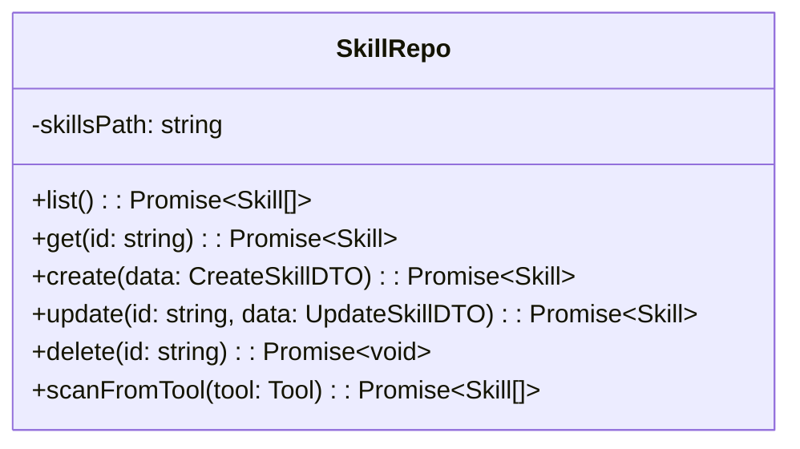
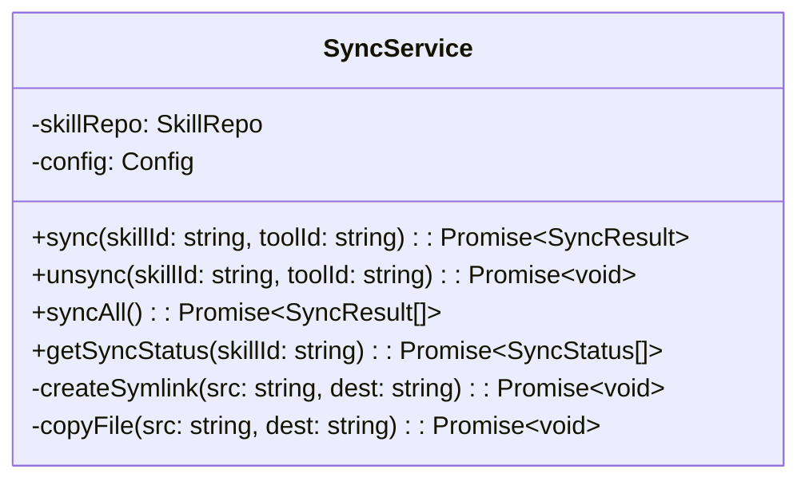
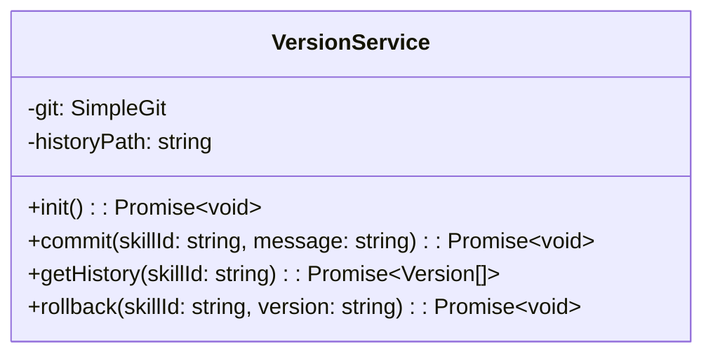
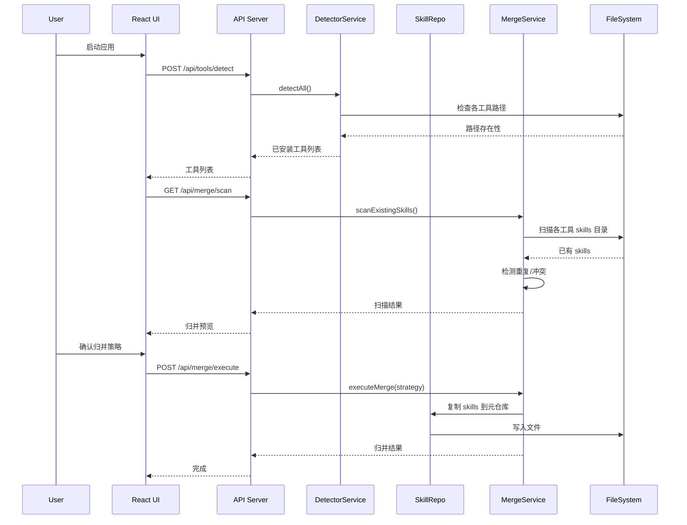
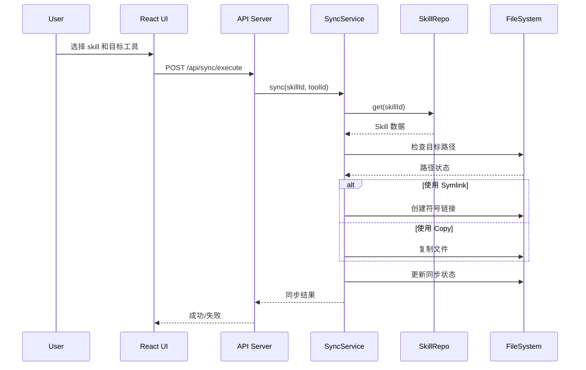
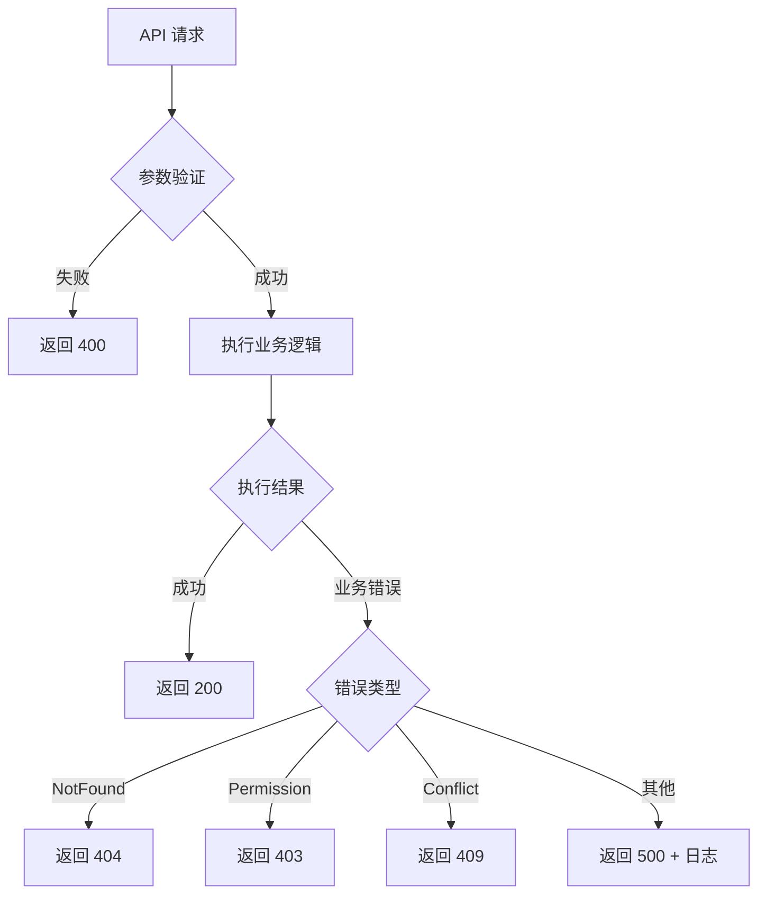

# DESIGN - 系统设计文档

## 1. 技术栈

### 主要语言
**TypeScript 5.3+**

### 运行时
**Node.js 20 LTS**

### 前端
| 技术 | 版本 | 用途 |
|------|------|------|
| React | 18.2 | UI 框架 |
| Vite | 5.0 | 构建工具 |
| Tailwind CSS | 3.4 | 样式框架 |
| React Router | 6.20 | 路由管理 |
| Zustand | 4.4 | 状态管理 |
| React Query | 5.8 | 数据获取 |
| Lucide React | 0.294 | 图标库 |

### 后端
| 技术 | 版本 | 用途 |
|------|------|------|
| Fastify | 4.24 | Web 框架 |
| fastify-static | 6.12 | 静态文件服务 |
| simple-git | 3.21 | Git 操作 |
| uuid | 9.0 | ID 生成 |
| chokidar | 3.5 | 文件监听 |

### 开发工具
| 工具 | 用途 |
|------|------|
| ESLint 8 | 代码检查 |
| Prettier 3 | 代码格式化 |
| TypeScript ESLint | TS 代码规则 |
| concurrently | 并行启动 |

---

## 2. 系统架构

### 整体架构图



### 分层设计



---

## 3. 核心模块设计

### 3.1 工具检测器 (Detector)



### 3.2 Skill 仓库服务 (SkillRepo)



### 3.3 同步服务 (SyncService)



### 3.4 版本管理服务 (VersionService)



---

## 4. 数据流向

### 4.1 首次归并流程



### 4.2 同步流程



---

## 5. 接口契约

### 5.1 工具检测接口

```typescript
interface DetectorResult {
  toolId: string;
  isInstalled: boolean;
  installedPath?: string;
  version?: string;
}

interface IDetector {
  id: string;
  name: string;
  type: 'cli' | 'ide';
  globalPath: string;
  projectPath: string;
  detect(): Promise<DetectorResult>;
}
```

### 5.2 Skill 接口

```typescript
interface Skill {
  id: string;
  name: string;
  content: string;
  description?: string;
  tags?: string[];
  source: {
    type: 'created' | 'imported' | 'merged';
    originalTools?: string[];
  };
  syncStatus: SyncStatus[];
  version: number;
  createdAt: string;
  updatedAt: string;
}

interface CreateSkillDTO {
  name: string;
  content: string;
  description?: string;
  tags?: string[];
}

interface UpdateSkillDTO {
  name?: string;
  content?: string;
  description?: string;
  tags?: string[];
}
```

### 5.3 同步接口

```typescript
interface SyncRequest {
  skillIds: string[];
  toolIds: string[];
  method?: 'symlink' | 'copy';
}

interface SyncResult {
  skillId: string;
  toolId: string;
  success: boolean;
  method: 'symlink' | 'copy';
  targetPath: string;
  error?: string;
}

interface SyncStatus {
  skillId: string;
  toolId: string;
  enabled: boolean;
  method: 'symlink' | 'copy' | 'none';
  lastSynced?: string;
  targetPath: string;
}
```

---

## 6. 异常处理策略

### 6.1 错误类型

| 错误码 | 类型 | 描述 | 处理方式 |
|--------|------|------|----------|
| E001 | SkillNotFound | Skill 不存在 | 返回 404 |
| E002 | ToolNotInstalled | 工具未安装 | 返回 400，提示安装 |
| E003 | SyncFailed | 同步失败 | 返回 500，记录日志 |
| E004 | PermissionDenied | 权限不足 | 返回 403，提示管理员权限 |
| E005 | PathExists | 目标路径已存在 | 返回 409，询问覆盖 |
| E006 | GitError | Git 操作失败 | 返回 500，降级处理 |

### 6.2 错误处理流程



---

## 7. 安全考虑

### 7.1 本地安全

| 风险 | 措施 |
|------|------|
| 路径遍历 | 验证所有路径在允许范围内 |
| 文件覆盖 | 同步前检查目标存在性 |
| 敏感信息 | 不存储密钥，只管理 skill 文件 |

### 7.2 API 安全

| 风险 | 措施 |
|------|------|
| 只监听本地 | 绑定 127.0.0.1，不暴露外网 |
| 输入验证 | 所有输入经过 schema 验证 |
| 错误信息 | 不暴露系统路径等敏感信息 |

---

## 8. 性能考虑

### 8.1 启动优化

- 前端 Vite 开发模式：按需编译
- 后端 Fastify：快速启动，延迟加载检测器
- 并行初始化：工具检测并行执行

### 8.2 运行时优化

- Skill 列表缓存：内存缓存 + 文件监听刷新
- 增量同步：只同步变更的 skill
- 懒加载：版本历史按需加载

---

## 9. UI 组件设计

### 9.1 页面结构

```
App
├── Layout
│   ├── Header
│   │   ├── Logo
│   │   ├── NavTabs
│   │   └── Actions (检测工具, 设置)
│   └── Main
│       ├── Dashboard (首页概览)
│       ├── Skills (Skill 管理)
│       ├── Tools (工具管理)
│       └── Settings (设置)
```

### 9.2 核心组件

| 组件 | 用途 | Props |
|------|------|-------|
| SkillCard | 展示单个 skill | skill, onEdit, onDelete, onSync |
| ToolCard | 展示单个工具 | tool, skillCount, onSync |
| SyncDialog | 同步选择对话框 | skills, tools, onConfirm |
| MergeDialog | 归并对话框 | conflicts, onResolve |
| SkillEditor | Skill 编辑器 | content, onChange, onSave |

---

## 10. 文件格式规范

### 10.1 Skill 目录结构

```
~/.skill-sync/skills/
├── code-review/
│   ├── SKILL.md          # 必需：skill 内容
│   └── meta.json         # 元数据（自动生成）
├── security-audit/
│   ├── SKILL.md
│   └── meta.json
└── ...
```

### 10.2 meta.json 格式

```json
{
  "id": "uuid-v4",
  "name": "code-review",
  "description": "代码审查 skill",
  "tags": ["review", "code"],
  "source": {
    "type": "created",
    "originalTools": []
  },
  "version": 1,
  "createdAt": "2024-01-01T00:00:00.000Z",
  "updatedAt": "2024-01-01T00:00:00.000Z"
}
```

### 10.3 config.json 格式

```json
{
  "version": "1.0.0",
  "skillsPath": "~/.skill-sync/skills/",
  "syncConfig": {
    "defaultMethod": "symlink"
  },
  "lastDetectedTools": []
}
```

---

## 11. 测试策略

### 11.1 单元测试

| 模块 | 测试重点 |
|------|----------|
| Detectors | 各检测器的检测逻辑 |
| SkillRepo | CRUD 操作 |
| SyncService | 同步逻辑，symlink/copy |
| VersionService | Git 操作封装 |

### 11.2 集成测试

| 场景 | 测试重点 |
|------|----------|
| 首次归并 | 扫描 → 冲突检测 → 归并 |
| 同步流程 | 选择 → 预览 → 执行 |
| 版本回滚 | 提交 → 历史 → 回滚 |

### 11.3 E2E 测试（可选）

| 场景 | 验证点 |
|------|--------|
| 完整流程 | 启动 → 归并 → 同步 → 验证文件 |
