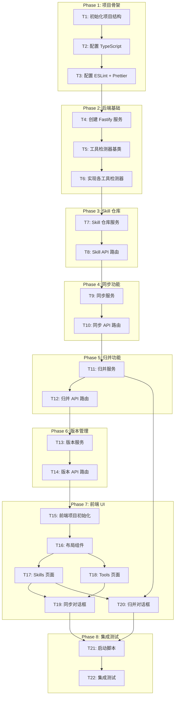

# TASK - 任务拆分文档

## 任务依赖图

---

## Phase 1: 项目骨架

### T1: 初始化项目结构

**输入契约**:
- 项目路径: `d:\RedBlue\AI写的\skill-sync`
- 设计文档: docs/DESIGN.md

**输出契约**:
- package.json (monorepo 配置)
- tsconfig.json (基础 TS 配置)
- 目录结构: server/, web/, docs/, scripts/

**实现约束**:
- 使用 npm workspaces 管理 monorepo
- Node.js 20+ 兼容

**验收标准**:
- [x] package.json 创建完成
- [x] 目录结构符合设计
- [x] npm install 可执行

---

### T2: 配置 TypeScript

**输入契约**:
- T1 完成
- tsconfig.json 基础配置

**输出契约**:
- tsconfig.base.json (共享配置)
- server/tsconfig.json (后端配置)
- web/tsconfig.json (前端配置)

**实现约束**:
- strict mode 启用
- ES2022 target
- NodeNext moduleResolution (后端)

**验收标准**:
- [x] TypeScript 编译通过
- [x] 共享配置正确继承

---

### T3: 配置 ESLint + Prettier

**输入契约**:
- T2 完成

**输出契约**:
- .eslintrc.js
- .prettierrc.json
- .eslintignore
- scripts/quality-check.ps1

**实现约束**:
- 规则: 圈复杂度 < 10, 文件 < 500 行
- 智能排除 node_modules, dist, docs

**验收标准**:
- [x] ESLint 检查可执行
- [x] Prettier 格式化可执行
- [x] PowerShell 脚本可执行

---

## Phase 2: 后端基础

### T4: 创建 Fastify 服务

**输入契约**:
- T3 完成
- Fastify 4.x

**输出契约**:
- server/index.ts (入口)
- server/app.ts (应用配置)
- server/routes/index.ts (路由注册)
- 健康检查端点: GET /api/health

**实现约束**:
- 监听 127.0.0.1:3001
- CORS 仅允许 localhost
- 错误处理中间件

**验收标准**:
- [x] 服务可启动
- [x] /api/health 返回 200
- [x] 错误处理正确

---

### T5: 工具检测器基类

**输入契约**:
- T4 完成

**输出契约**:
- server/detectors/base.ts (基类)
- server/detectors/types.ts (类型定义)

**实现约束**:
- 抽象类定义
- 支持 command 和 path 两种检测方式
- 跨平台路径处理

**验收标准**:
- [x] 基类可被继承
- [x] 类型定义完整
- [x] 路径处理正确

---

### T6: 实现各工具检测器

**输入契约**:
- T5 完成
- 工具列表: docs/ALIGNMENT.md

**输出契约**:
- server/detectors/claude-code.ts
- server/detectors/cursor.ts
- server/detectors/windsurf.ts
- server/detectors/trae.ts
- server/detectors/kiro.ts
- server/detectors/copilot.ts
- server/detectors/gemini.ts
- server/detectors/codex.ts
- server/detectors/opencode.ts
- server/detectors/roo.ts
- server/detectors/qoder.ts
- server/detectors/codebuddy.ts
- server/detectors/antigravity.ts
- server/detectors/factory.ts
- server/detectors/index.ts (注册表)

**实现约束**:
- 每个检测器 < 50 行
- 统一错误处理
- Windows 路径兼容

**验收标准**:
- [x] 14 个检测器实现
- [x] 检测逻辑正确
- [x] 注册表完整

---

## Phase 3: Skill 仓库

### T7: Skill 仓库服务

**输入契约**:
- T6 完成
- 元仓库路径: ~/.skill-sync/skills/

**输出契约**:
- server/services/skill-repo.ts
- 支持操作: list, get, create, update, delete
- 支持从工具目录扫描 skills

**实现约束**:
- 文件格式: SKILL.md + meta.json
- 自动生成 UUID
- 更新时间自动维护

**验收标准**:
- [x] CRUD 操作正确
- [x] 文件格式符合规范
- [x] 扫描功能正确

---

### T8: Skill API 路由

**输入契约**:
- T7 完成

**输出契约**:
- server/routes/skills.ts
- GET /api/skills
- GET /api/skills/:id
- POST /api/skills
- PUT /api/skills/:id
- DELETE /api/skills/:id

**实现约束**:
- 请求验证
- 统一响应格式
- 错误处理

**验收标准**:
- [x] 所有端点可访问
- [x] 验证正确
- [x] 错误响应规范

---

## Phase 4: 同步功能

### T9: 同步服务

**输入契约**:
- T7 完成
- 工具检测器可用

**输出契约**:
- server/services/sync.ts
- 支持操作: sync, unsync, syncAll, getSyncStatus
- 支持 symlink 和 copy 两种方式

**实现约束**:
- Windows symlink 需要管理员权限检测
- 目标路径存在性检查
- 同步状态持久化

**验收标准**:
- [x] symlink 同步正确
- [x] copy 同步正确
- [x] 权限检测正确
- [x] 状态持久化

---

### T10: 同步 API 路由

**输入契约**:
- T9 完成

**输出契约**:
- server/routes/sync.ts
- GET /api/sync/status
- POST /api/sync/preview
- POST /api/sync/execute
- POST /api/sync/skill/:id

**实现约束**:
- 批量同步支持
- 预览功能（不实际执行）

**验收标准**:
- [x] 所有端点可访问
- [x] 预览功能正确
- [x] 批量同步正确

---

## Phase 5: 归并功能

### T11: 归并服务

**输入契约**:
- T7, T9 完成

**输出契约**:
- server/services/merge.ts
- 支持操作: scan, preview, execute
- 冲突检测和解决策略

**实现约束**:
- 冲突策略: skip, rename, overwrite
- 归并时保留来源信息

**验收标准**:
- [x] 扫描功能正确
- [x] 冲突检测正确
- [x] 归并执行正确

---

### T12: 归并 API 路由

**输入契约**:
- T11 完成

**输出契约**:
- server/routes/merge.ts
- GET /api/merge/scan
- POST /api/merge/preview
- POST /api/merge/execute

**验收标准**:
- [x] 所有端点可访问
- [x] 预览功能正确

---

## Phase 6: 版本管理

### T13: 版本服务

**输入契约**:
- T7 完成
- simple-git 库

**输出契约**:
- server/services/version.ts
- 支持操作: init, commit, getHistory, rollback

**实现约束**:
- 每个 skill 变更自动 commit
- 历史存储在 ~/.skill-sync/history/
- 回滚时恢复文件内容

**验收标准**:
- [x] commit 功能正确
- [x] 历史查询正确
- [x] 回滚功能正确

---

### T14: 版本 API 路由

**输入契约**:
- T13 完成

**输出契约**:
- server/routes/versions.ts
- GET /api/skills/:id/versions
- POST /api/skills/:id/rollback/:v

**验收标准**:
- [x] 历史查询正确
- [x] 回滚功能正确

---

## Phase 7: 前端 UI

### T15: 前端项目初始化

**输入契约**:
- 后端 API 可用

**输出契约**:
- web/ 目录结构
- vite.config.ts
- tailwind.config.js
- 基础样式

**实现约束**:
- React 18 + Vite 5 + Tailwind 3
- API 代理到 localhost:3001

**验收标准**:
- [x] npm run dev 可启动
- [x] 页面可访问

---

### T16: 布局组件

**输入契约**:
- T15 完成

**输出契约**:
- web/src/App.tsx
- web/src/components/Layout.tsx
- web/src/components/Header.tsx
- web/src/components/NavTabs.tsx

**验收标准**:
- [x] 布局正确显示
- [x] 导航功能正常

---

### T17: Skills 页面

**输入契约**:
- T16 完成

**输出契约**:
- web/src/pages/Skills.tsx
- web/src/components/SkillCard.tsx
- web/src/components/SkillEditor.tsx

**验收标准**:
- [x] Skill 列表显示
- [x] 创建/编辑功能
- [x] 删除功能

---

### T18: Tools 页面

**输入契约**:
- T16 完成

**输出契约**:
- web/src/pages/Tools.tsx
- web/src/components/ToolCard.tsx

**验收标准**:
- [x] 工具列表显示
- [x] 检测功能

---

### T19: 同步对话框

**输入契约**:
- T17, T18 完成

**输出契约**:
- web/src/components/SyncDialog.tsx

**验收标准**:
- [x] 对话框显示正确
- [x] 同步选择功能
- [x] 执行同步

---

### T20: 归并对话框

**输入契约**:
- T17 完成

**输出契约**:
- web/src/components/MergeDialog.tsx

**验收标准**:
- [x] 归并预览显示
- [x] 冲突解决选择
- [x] 执行归并

---

## Phase 8: 集成测试

### T21: 启动脚本

**输入契约**:
- 前后端完成

**输出契约**:
- 根 package.json scripts
- npm start: 同时启动前后端
- npm run dev: 开发模式

**验收标准**:
- [x] npm start 正常启动
- [x] 浏览器可访问

---

### T22: 集成测试

**输入契约**:
- T21 完成

**输出契约**:
- 完整功能验证
- docs/ACCEPTANCE.md 更新

**验收标准**:
- [x] 工具检测正常
- [x] Skill 管理正常
- [x] 同步功能正常
- [x] 归并功能正常
